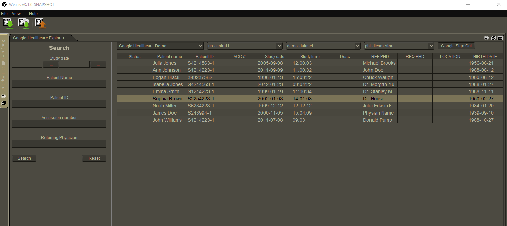

## About Weasis Google DICOM Plugin

Plugin enables Weasis Viewer users access to [Google Cloud Healthcare API](https://cloud.google.com/healthcare) DICOM data.
It utilizes [DICOMweb REST API](https://cloud.google.com/healthcare/docs/how-tos/dicomweb) to interact with Google Cloud services.

### Features

* Login using your Google account
* Interactive exploration of Google Healthcare API Dicom stores
* Download and display all kinds of DICOM data
* Advanced study search capabilities



### Running the plugin

The plugin runs as an extension to the main Weasis application, so first you
need to download the main Weasis application from https://nroduit.github.io/en/.

***Please note, latest supported release of Weasis is [3.6.0](https://github.com/nroduit/Weasis/releases/tag/v3.6.0)***

Then you need to have existing data in the Cloud Healthcare API and install the
plugin to get up and running. Please see more detailed instructions below.

#### Setting up Google Cloud Healthcare API:

See https://cloud.google.com/healthcare/docs/ to get started.

#### Installing plugin

* Get the latest release JAR from this repositories releases tab.
* Follow instructions at [installing
  plug-ins](https://nroduit.github.io/en/basics/customize/build-plugins/#install-plug-ins)
  to add this plugin to Weasis.
* Run Weasis Viewer executable
* Switch to **_Google Dicom Explorer_** tab and login using your Google Account
> NOTE: If you face with some issues when using the plugin, you should remove .Weasis folder wich may cache previous or 
> incorrect settings for the plugin in Weasis.

#### Using your own OAuth client

The plugin comes with it's own OAuth Client ID for ease of installation, but you can substitute 
your own if required (e.g. your organization has OAuth policy restriction on external apps). To do 
this go to the [Google API Console](https://console.developers.google.com/) and create a set of 
OAuth 2.0 credentials using the type "Other" and make sure to whitelist the scopes 
`.../auth/cloud-healthcare` and `.../auth/cloudplatformprojects.readonly`. Then download the 
credentials files in JSON format, name the file `client_secrets.json` and move it to conf
folder, next to the ext-config.properties file.

### Building plugin

If you're just trying to run the tool, please see the instructions above. If you
need to recompile the plugin for any reason here are the steps to do so.

Weasis requires JDK14.
Plugin depends on core Weasis API, that's why you have to clone, build and install core Weasis modules to
your local Maven repository first
For this purpose follow instructions at [building Weasis](https://nroduit.github.io/en/getting-started/building-weasis/).
After Weasis artifacts installed to your local Maven repository plugin itself can be compiled
Detailed build instruction can be found at
[building Weasis plugins](https://nroduit.github.io/en/basics/customize/build-plugins/)
Clone this repository and execute following script:
```bash
cd weasis-chcapi-extension

## build plugin
mvn clean install
```


